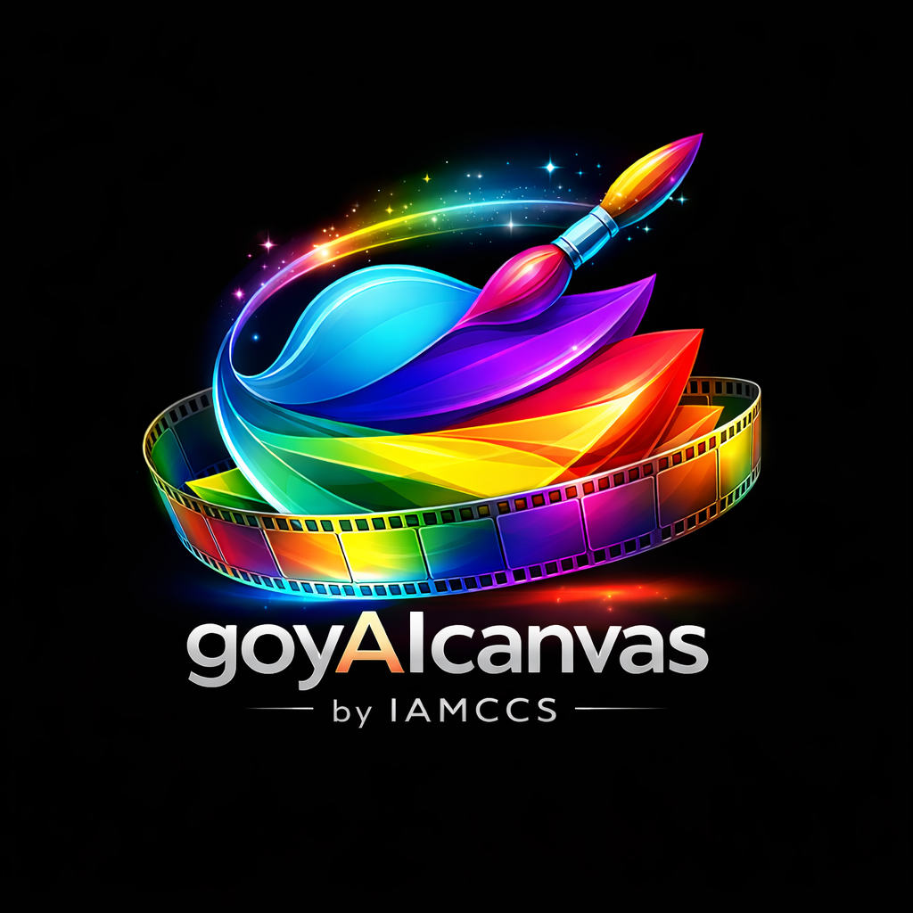
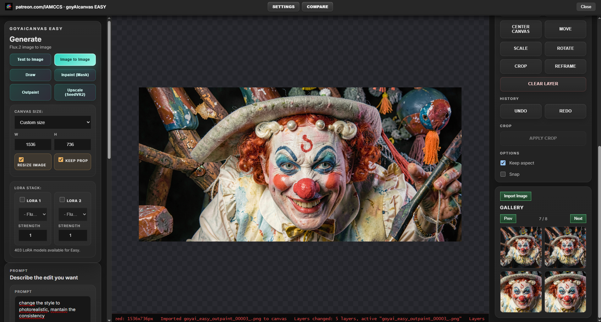
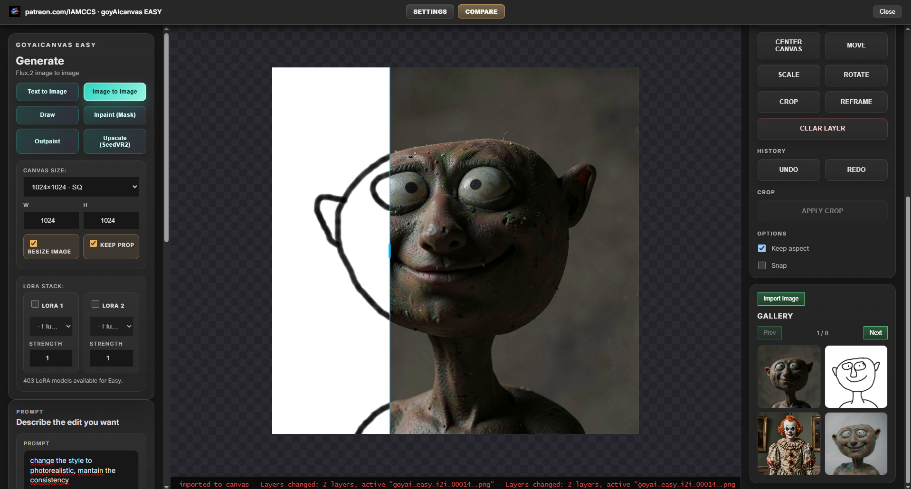
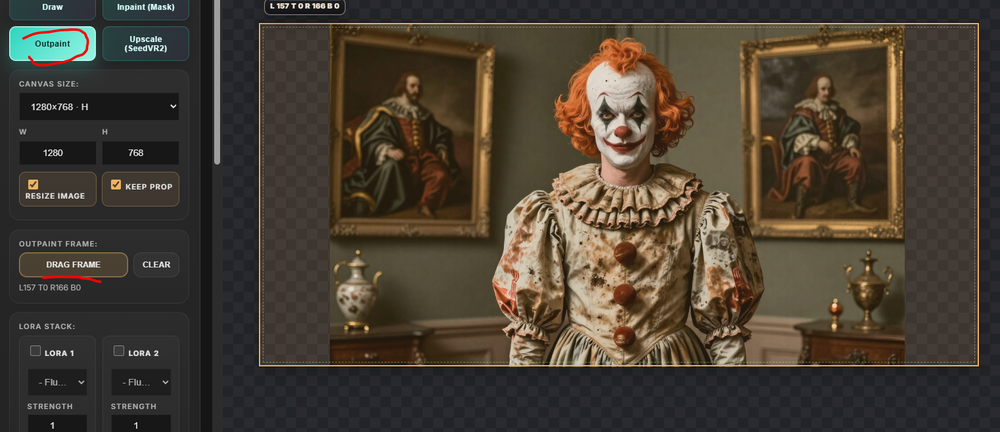
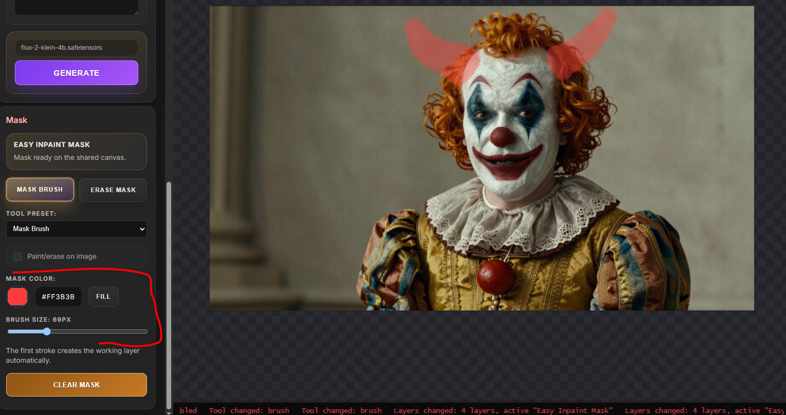
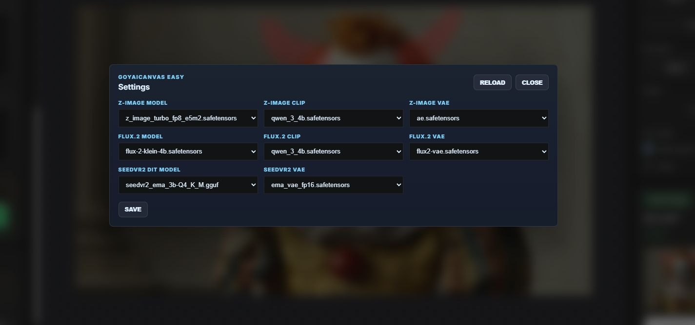

# goyAIcanvas EASY



**Version:** 1.0.2  
**Author / project:** [patreon.com/IAMCCS](https://patreon.com/IAMCCS)  
**ComfyUI node name:** `IAMCCS_goyAIcanvas-easy`

goyAIcanvas EASY is a standalone all-in-one ComfyUI image editor node focused on a clean canvas workflow: text to image, image to image, draw-to-image, inpaint, outpaint, upscale, gallery import, model selection, LoRA stack, and a compact professional UI.

EASY is not a wrapper for the larger goyAIcanvas node. It is a separate node with its own backend routes, workflows, UI, settings, output folder, and editor surface.

## Screenshots











## Main Features

- Open Editor first workflow: the node is operated from its full editor, not from exposed node widgets.
- Professional grey UI aligned with the goyAIcanvas family.
- Canvas size presets and custom canvas size.
- Resize / keep proportions controls for existing canvas images.
- Text to image templates.
- Image to image with canvas composite input.
- Draw mode that routes through the image-to-image backend.
- Brush / pencil / erase / fill tools.
- Inpaint with brush mask workflow.
- Outpaint with draggable frame outside the image.
- Gallery import and delete from gallery view while keeping generated files in output.
- Compare current image with previous/source image.
- Backend settings for template/model selection.
- Dynamic model discovery from ComfyUI model folders and `extra_model_paths.yaml`.
- Hidden backend output for ComfyUI workflow persistence, without exposing an output socket in the UI.

## Output Folder

Generated images are saved under:

```text
ComfyUI/output/goya_output
```

The gallery reads from this output area and imports selected results back into the canvas.

## Working Requirements

### Required

- A working ComfyUI installation.
- This folder installed as:

```text
ComfyUI/custom_nodes/IAMCCS_goyAIcanvas-easy
```

- Restart ComfyUI after installing or updating the Python backend.
- Refresh the browser after ComfyUI restart.

### Core ComfyUI Nodes Used

The included workflows use standard ComfyUI nodes such as:

- `LoadImage`
- `SaveImage`
- `CLIPLoader`
- `UNETLoader`
- `VAELoader`
- `CheckpointLoaderSimple`
- `CLIPTextEncode`
- `VAEEncode`
- `VAEDecode`
- `KSampler`
- `ImageScaleBy`
- `ImageScaleToTotalPixels`
- `ImageToMask`

### Optional / Template-Specific Custom Node Packs

Some templates require additional custom nodes. Install only what is needed for the templates you plan to use.

- `ComfyUI-GGUF`
  Required for GGUF loader workflows such as `CLIPLoaderGGUF`.

- `comfyui-kjnodes`
  Required for workflows using nodes such as `ImageResizeKJv2`.

- `comfyui-inpaint-cropandstitch`
  Required for inpaint/outpaint workflows using nodes such as `InpaintCropImproved` and `InpaintStitchImproved`.

- `seedvr2_videoupscaler`
  Required for the SeedVR2 upscale workflow using `SeedVR2LoadVAEModel`, `SeedVR2LoadDiTModel`, and `SeedVR2VideoUpscaler`.

- Background removal nodes
  Required only for the remove-background workflow using nodes such as `LoadBackgroundRemovalModel`, `RemoveBackground`, `InvertMask`, and `JoinImageWithAlpha`.

### Model Requirements

Models are not hardcoded. The user can choose installed models from ComfyUI model directories and from paths configured in `extra_model_paths.yaml`.

Recommended commercial-friendly working state:

- Z-Image compatible model/template, for example Z-Image Turbo AIO if installed.
- Flux.2 Klein / 4B compatible model/template.
- A compatible VAE.
- Compatible CLIP/text encoder files where the selected template requires separate components.

Optional templates may require:

- Flux.2 / FL9B compatible model files for 9B workflows.
- GGUF text encoder or model files for GGUF workflows.
- SeedVR2 DiT and VAE models for SeedVR2 upscale.
- LoRA files in ComfyUI LoRA folders for the Easy LoRA stack.

## Model License Disclaimer

Commercially usable workflows depend on the license of the models you install and select.

The intended commercial-friendly working choices for this node are Z-Image and Flux 4B / Flux.2 Klein compatible model setups, when used under model licenses that permit your use case.

If you use Flux 9B, FL9B, experimental, research-only, non-commercial, or third-party models, you must check and follow the original license of each model. This node does not grant commercial rights for any model, checkpoint, LoRA, VAE, CLIP, text encoder, or dataset.

## Roadmap

### goyAIcanvas Advanced - Coming Soon

goyAIcanvas Advanced will extend the Easy concept with deeper image editing features, including:

- Advanced image editing tools.
- Style systems.
- Multi-inpaint workflows.
- More generation modules.
- Advanced masking.
- Liquify-style image editing.
- Intelligent masking utilities.
- More professional image correction tools.

### goyAIcanvas Full - Coming Soon

goyAIcanvas Full will expand beyond image editing into production modules, including:

- Video production modules.
- Shotboard implementation.
- Audioboard implementation.
- Extended production board workflows.
- More generation and media orchestration modules.

### goyAIcanvas Complete - Coming Soon

goyAIcanvas Complete will include the widest production environment, including:

- Video editing modules.
- FIELD video workflow integration.
- Advanced video color correction.
- More video finishing and production tools.
- Additional high-level media production systems.

## Installation

1. Place this folder in:

```text
ComfyUI/custom_nodes/IAMCCS_goyAIcanvas-easy
```

2. Install the custom node packs required by the workflow templates you plan to use.
3. Place compatible models in the relevant ComfyUI model folders or configure them through `extra_model_paths.yaml`.
4. Restart ComfyUI.
5. Add `IAMCCS_goyAIcanvas-easy` to the graph.
6. Click the node logo to open the editor.

## License

This project is intended to be compatible with distribution through ComfyUI-Manager.

The source code is licensed under the **Apache License 2.0**, with attribution required by the license terms. Copies, forks, redistributions, and derivative works must preserve the license notice and provide clear attribution to:

```text
IAMCCS / patreon.com/IAMCCS
```

Do not remove author, project, license, or attribution notices from source files, documentation, or redistributed packages.

Model files are not included and are governed by their own licenses.

## Support

Support and development updates:

[patreon.com/IAMCCS](https://patreon.com/IAMCCS)

### If my work helped you, and you’d like to say thanks — grab me a coffee ☕

<a href="https://www.buymeacoffee.com/iamccs" target="_blank">
  
</a>
